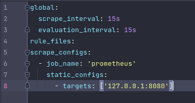
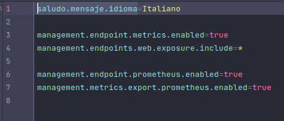
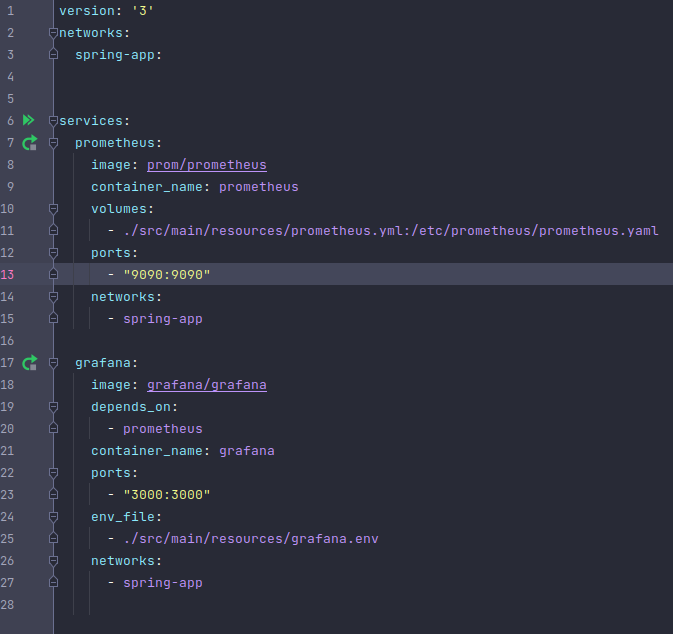
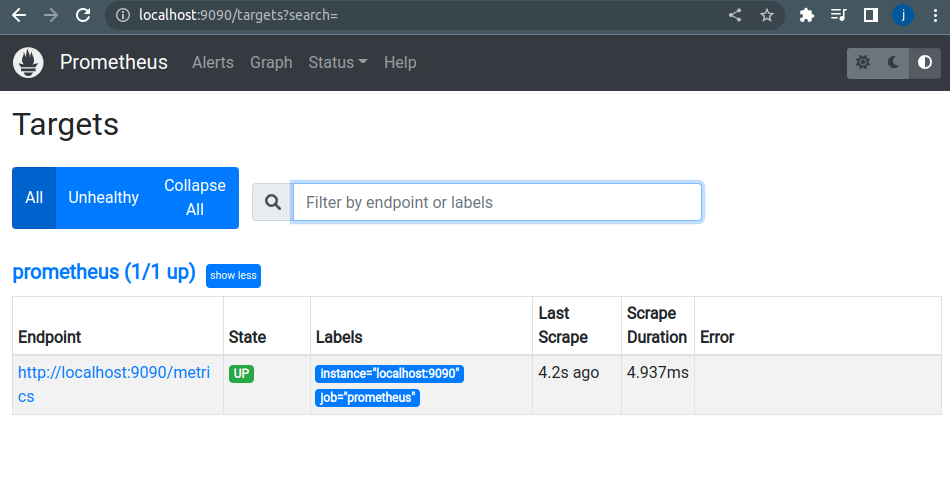
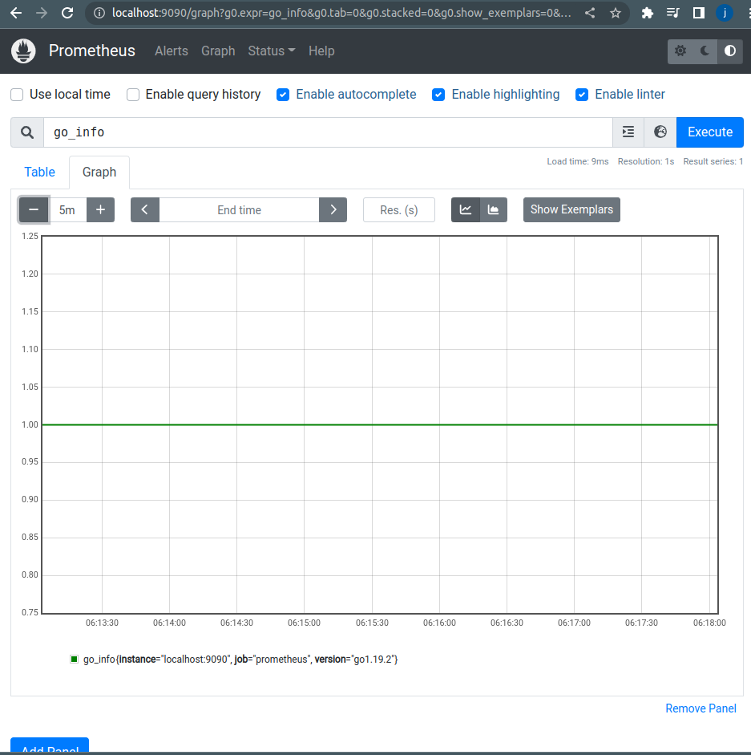
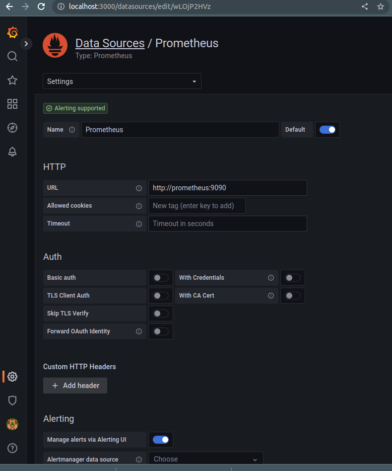
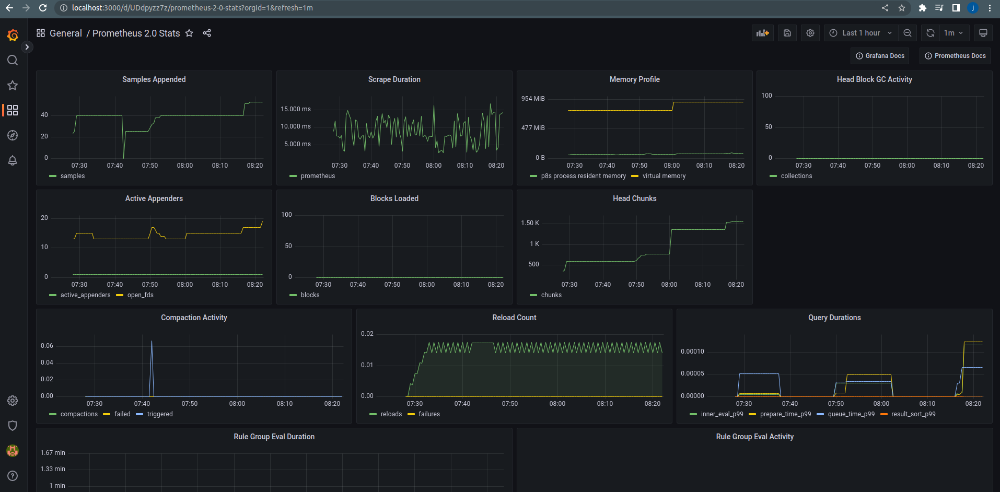

# EJEMPLO PROMETHEUS Y GRAFANA

- configuración prometheus

- parámetros configurados en application.properties

- docker-compose prometheus y grafana

- Capturas de funcionamiento Prometheus:

- Capturas de funcionamineto Grafana:

